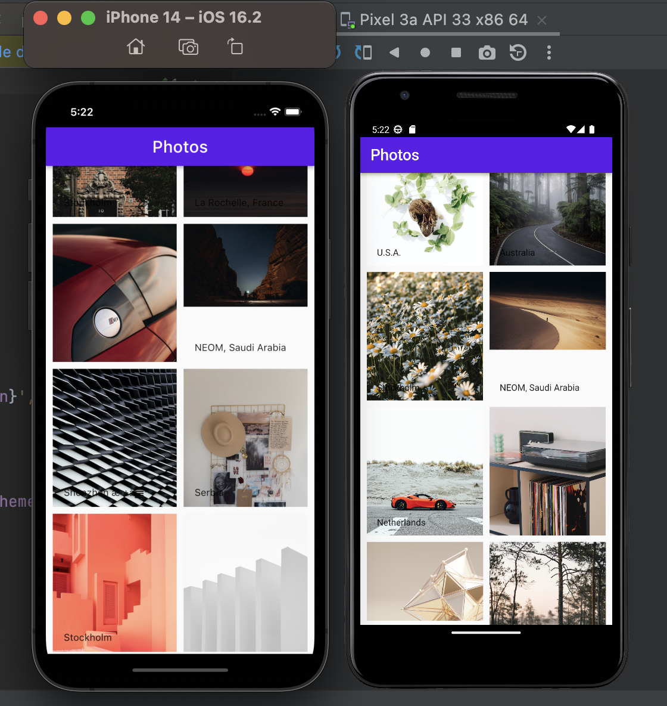
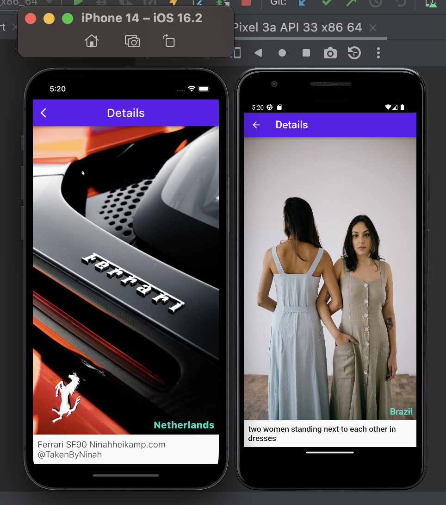

## earnipay :gift_heart:

A  Flutter app that fetches a paginated list of images from a remote repository.

## About App :+1:

This app displays a paginated list of images and displays them lazily on the home page.

More images are being fetched when the user scrolls to the bottom of the list.

When a user clicks on an image, the app navigates to a new screen where the image is displayed in a larger form with its details.

The application is responsive on both Android and iOs mobile phones.

## State Management :star_struck:

The app uses [bloc state management](https://pub.dev/packages/flutter_bloc) approach.

Every screen belongs to its own module and a module has a bloc folder where the Bloc, State and Event class live.
Every module also has a view where the UI for the module live.

The app uses [http package](https://pub.dev/packages/http) for making network calls.

## :muscle: Performance Optimization :muscle:

I ensured I used const where necessary for widgets so widgets do not rebuild when its state has not changed.

For the list of images and titles, I used [CustomScrollView](https://api.flutter.dev/flutter/widgets/CustomScrollView-class.html) so the list could be rendered efficiently and customisable and the images are cached to ensure they are not always fetched anytime the user goes to the home page. And such cached image could be effortlessly displayed on the image details page.
 ## :surfing_man: Testing :horse_racing:

## :green_square: How to run the app :white_check_mark:
## :people_hugging: Let's snap the app...
___
